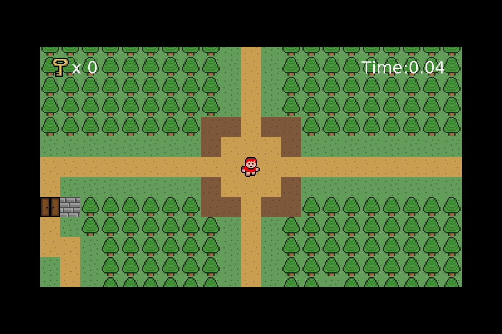

# My First Game

A 2D Java adventure game built with Java Swing. The project focuses on core game-programming concepts such as a real-time game loop, tile-based worlds, collision detection, player movement, interactive objects, animation, sound and HUD rendering.

## Features

- Real-time game loop
- Tile-based world and map loading
- Player movement and animation
- Tile and object collision detection
- Interactive keys, doors and chests
- Health/status HUD
- Background music and sound effects
- Multiple world objects and collectible items
- Camera/world rendering
- Keyboard controls
- Debug draw-time information

## Technology

- Java
- Java Swing / AWT
- 2D graphics
- Object-oriented programming
- Thread-based game loop

## Project Structure

~~~text
src/
├── entity/    Player and entity classes
├── main/      Game loop, input, audio, UI and collision systems
├── object/    Interactive world objects
└── tile/      Tile and world-map management

res/
├── maps/
├── objects/
├── player/
├── sound/
└── tiles/
~~~

Generated build output is intentionally excluded from the repository.

## Run

Requirements: **Java 17+**.

Compile from the repository root:

~~~bash
mkdir -p out
javac -d out $(find src -name "*.java")
~~~

Then run:

~~~bash
java -cp out main.Main
~~~

The `res/` directory must remain available from the repository root at runtime. In an IDE, run `main.Main` with the project root as the working directory.

## Controls

The keyboard controls are handled by KeyHandler.java. The exact in-game controls are shown/implemented there.

## Portfolio Focus

This project demonstrates:

- Java OOP
- Game-loop design
- Real-time input handling
- Collision detection
- Tile/map systems
- Resource loading
- Animation
- Audio playback
- 2D rendering
- Basic game architecture

## Important Asset Note

Some artwork and audio in the original project may come from tutorial or third-party resources. Before distributing the game or using it commercially, verify the license/redistribution rights for every external asset. The code and project organization should not be presented as ownership of third-party assets.

## Future Improvements

- Replace or document all third-party assets
- Add a proper game-state system
- Improve the game loop with a fixed update timestep
- Add enemies and combat
- Add save/load support
- Add a settings menu
- Package a runnable JAR
- Add screenshots or a gameplay GIF

## 🌐 Links

**Portfolio:** https://ragibashhab.netlify.app/

**GitHub:** https://github.com/TheKIAR

**LinkedIn:** https://www.linkedin.com/in/md-ragib-ashhab-768a19240/

**Linktree:** https://linktr.ee/RagibAshhab
