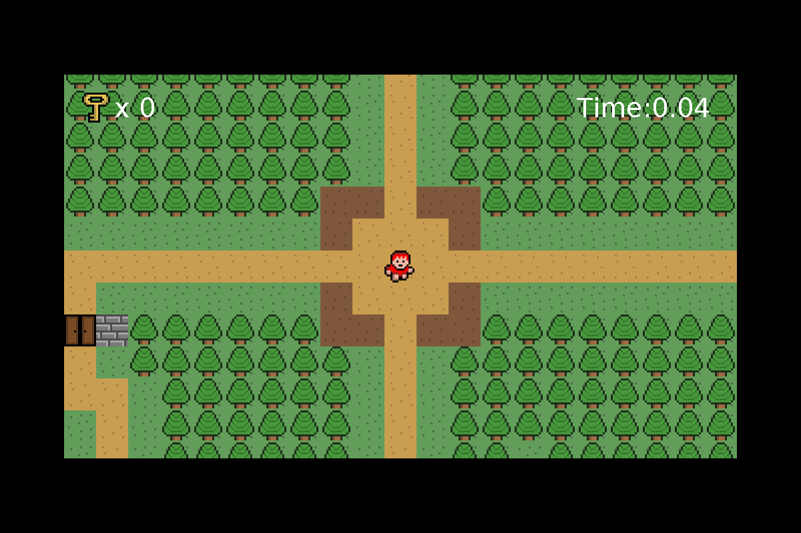

# 🎮 My First Game

<p align="center">
  
</p>

<p align="center">
  <strong>Java • 2D Game Development • Swing/AWT • Real-Time Systems</strong><br>
  A hands-on adventure game project built to explore the foundations of game programming.
</p>

<p align="center">
  <a href="https://github.com/TheKIAR/My-First-Game/actions/workflows/ci.yml"></a>
  
  
</p>

---

## 🕹️ Meet the project

This is my first complete game project — a practical way to learn how a 2D game works under the hood.

It focuses on the fundamentals that make a game feel alive: a real-time loop, player input, a tile-based world, collisions, animation, sound, objects and a HUD.

## 🖼️ Gameplay preview

<p align="center">
  
</p>

<p align="center">
  
</p>

## ✨ Features

- 🔄 Real-time game loop
- 🗺️ Tile-based world and map loading
- 🧍 Player movement and animation
- 🧱 Tile and object collision detection
- 🔑 Interactive keys, doors and chests
- ❤️ Health / status HUD
- 🔊 Background music and sound effects
- 🎒 Collectible items and world objects
- 📷 Camera / world rendering
- ⌨️ Keyboard controls
- 🐞 Debug draw-time information

## 🧩 Architecture

```text
Game Loop
   ├── Input
   ├── Player / Entities
   ├── Collision
   ├── World & Tiles
   ├── Objects
   ├── Audio
   └── UI / HUD
```

## 🛠️ Run locally

**Requirements:** Java 17+.

From the repository root:

```bash
mkdir -p out
javac -d out $(find src -name "*.java")
java -cp out main.Main
```

Keep the `res/` directory at the repository root while running.

## 🎮 Controls

Controls are handled by `KeyHandler.java`; the exact mappings are implemented there.

## 🧠 Portfolio focus

This project demonstrates:

- Java OOP
- Game-loop design
- Real-time input handling
- Collision detection
- Tile/map systems
- Resource loading
- Animation
- Audio playback
- 2D rendering
- Basic game architecture

## ⚠️ Asset note

Some artwork and audio may come from tutorial or third-party resources. Before redistributing or using the game commercially, verify the license and redistribution rights for every external asset.

## 🚀 Next upgrades

- Replace or document third-party assets
- Add a proper game-state system
- Fixed-update game loop
- Enemies and combat
- Save/load support
- Settings menu
- Runnable JAR packaging
- More gameplay capture media

## 👋 Connect

Built by **Md. Ragib Ashhab**.

🌐 [Portfolio](https://ragibashhab.netlify.app/) · 💼 [LinkedIn](https://www.linkedin.com/in/md-ragib-ashhab-768a19240/) · 🔗 [Linktree](https://linktr.ee/RagibAshhab) · 🐙 [GitHub](https://github.com/TheKIAR)

---

> **Start small. Build a game. Learn how everything works.**
